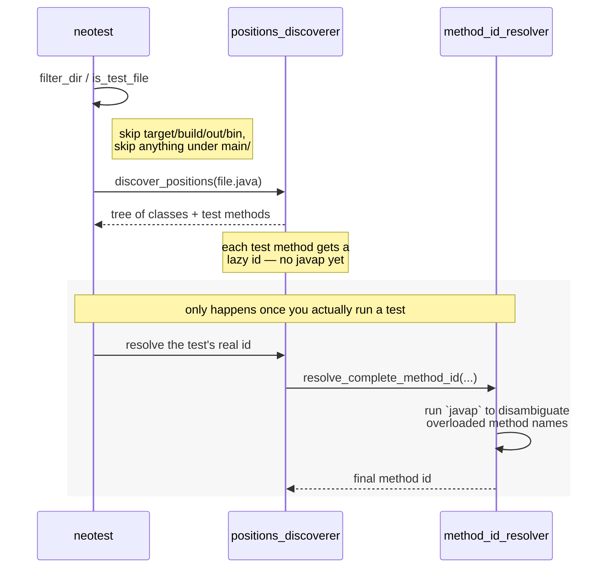
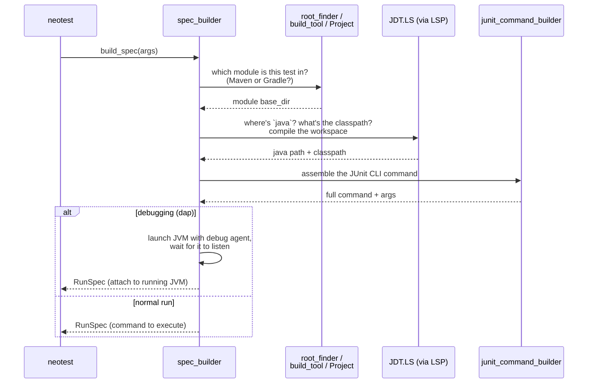
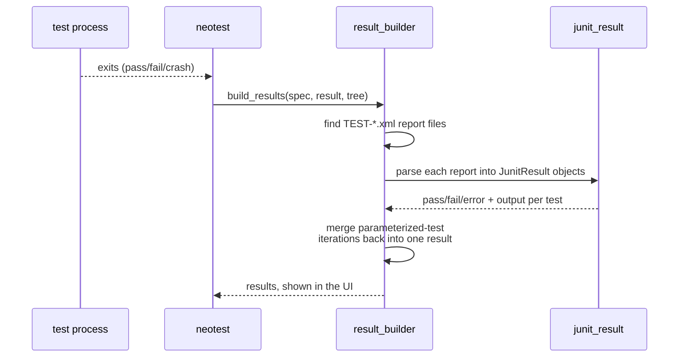
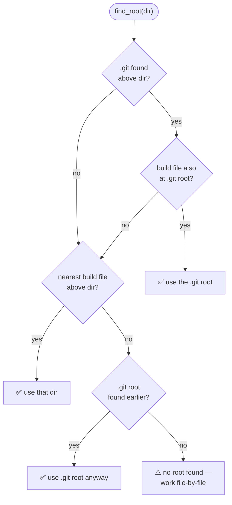
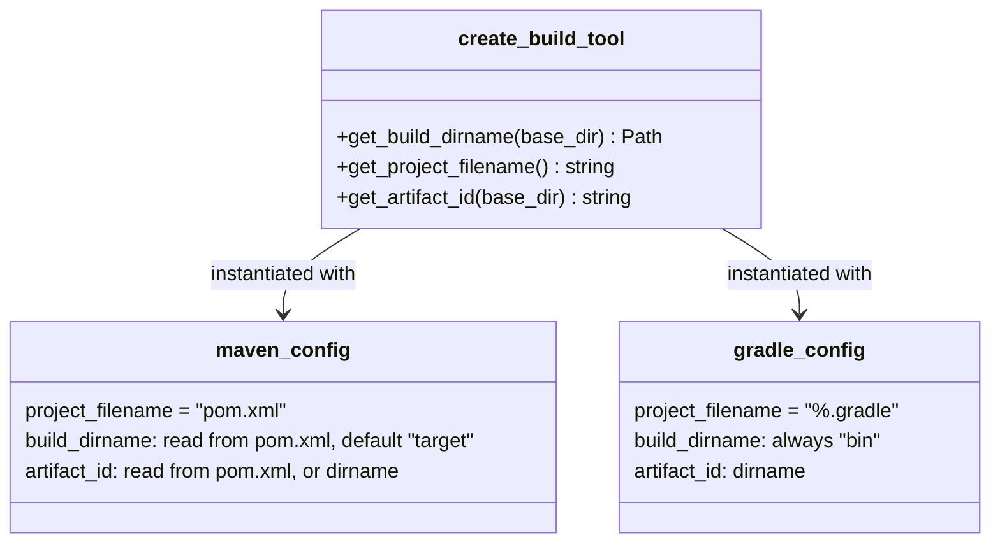

# Architecture

This document explains how neotest-java works internally by walking
through the four flows that connect Neovim/neotest to a running JUnit
process and back. It's aimed at anyone reading the codebase for the first
time who wants to know "where do I look if I need to change X?".

For contributor conventions (branching, commits, test-writing rules,
OpenSpec workflow) see [AGENTS.md](./AGENTS.md).

## What this plugin depends on

neotest-java doesn't work standalone — it's a `neotest` adapter that
leans on several other Neovim ecosystem projects and one external Java
tool. Understanding this matters because most of the flows below hand
off work to one of these:

| Project | Required? | What neotest-java uses it for |
|---|---|---|
| [`nvim-neotest/neotest`](https://github.com/nvim-neotest/neotest) | Yes | The framework this *is* an adapter for — defines `neotest.Adapter`, `RunSpec`, `Result`, `Tree`, and the `lib.files`/`lib.treesitter` helpers reused directly in `core/`. |
| [`nvim-neotest/nvim-nio`](https://github.com/nvim-neotest/nvim-nio) | Yes | Async runtime (`nio`) — lets LSP requests and process calls happen off the main thread without blocking Neovim. |
| [`nvim-treesitter`](https://github.com/nvim-treesitter/nvim-treesitter) + `tree-sitter-java` | Yes | Parses Java source so `positions_discoverer.lua` can find classes and test methods (see [flow 1](#1-test-discovery)). |
| A Java language server (e.g. [`nvim-jdtls`](https://github.com/mfussenegger/nvim-jdtls)/JDT.LS) | Yes, at runtime | neotest-java doesn't bundle or configure a Java LSP itself — it just looks for an already-attached client named `jdtls` (`core/spec_builder/compiler/client_provider.lua`) to resolve the `java` binary, the classpath, and to trigger workspace compiles (see [flow 2](#2-spec-building)). No `jdtls` client attached means spec building can't proceed. |
| [`mfussenegger/nvim-dap`](https://github.com/mfussenegger/nvim-dap) | Only for debugging | Only required if you run tests with `strategy = "dap"`; both `core/spec_builder/init.lua` and `build_tool/launcher.lua` `pcall`-require it and fail gracefully/loudly if it's missing. |
| [JUnit Platform Console Standalone](https://mvnrepository.com/artifact/org.junit.platform/junit-platform-console-standalone) (a jar, not a plugin) | Yes | The actual test runner — downloaded by `install.lua` and invoked as a subprocess by the command built in [flow 2](#2-spec-building). |

## The four flows

Everything the adapter does falls into one of these:

1. **[Test discovery](#1-test-discovery)** — find `.java` test files and
   the test methods inside them.
2. **[Spec building](#2-spec-building)** — turn "run this test" into an
   actual `java ...` command.
3. **[Running results](#3-running-results)** — turn the JUnit XML report
   back into pass/fail results neotest can show.
4. **[Finding the project root](#4-finding-the-project-root)** — a small
   flow used by both of the above.

---

## 1. Test discovery

*Triggered when neotest scans your project's files/directories.*



**In plain terms:** neotest asks "should I look in this directory?" and
"is this file a test file?" before it ever parses anything — cheap string
checks (`core/dir_filter.lua`, `core/file_checker.lua`). For files that
pass, `core/positions_discoverer.lua` runs a tree-sitter query to find
classes and `@Test`/`@ParameterizedTest`/... methods and builds neotest's
position tree. Figuring out the *exact* JUnit selector for an overloaded
method requires shelling out to `javap`, which is slow — so that only
happens lazily, the moment you actually run a specific test
(`method_id_resolver.lua`).

## 2. Spec building

*Triggered when you run a test — turns "run this" into a real command.*



**In plain terms:** `core/spec_builder/init.lua` is the orchestrator. It
figures out which module the test belongs to (Maven or Gradle,
single-module or multi-module — see [root
finding](#4-finding-the-project-root)), asks the Java LSP client (JDT.LS)
for the `java` binary path and the project's classpath, triggers a
workspace compile, and hands everything to
`command/junit_command_builder.lua`, which assembles the actual
`java -jar junit-platform-console-standalone.jar ...` invocation with the
right `--select-method`/`--select-class` selectors. If you're debugging
(`strategy = "dap"`), it launches the JVM itself and waits for the debug
agent to start listening instead of handing a plain command back to
neotest.

## 3. Running results

*Triggered after the test process exits — turns XML into UI results.*



**In plain terms:** `core/result_builder.lua` looks for the
`TEST-*.xml` files JUnit wrote to the reports directory, and
`core/junit_result_reader.lua` + `model/junit_result.lua` parse them into
pass/fail/error status with output and stack traces. One extra step: a
single `@ParameterizedTest`/`@TestFactory` method produces *multiple*
JUnit testcases (one per invocation) — `result_builder.lua` groups those
back together and merges them into a single result for the one tree node
neotest knows about, then deletes the temporary report files.

## 4. Finding the project root

*Used by both discovery and spec building to know "what project am I in?".*



**In plain terms:** `.git` + a build file at the *same* directory wins
(most useful for multi-module repos, since it gives you the repo root
rather than a nested module). Otherwise the nearest build file alone is
used. A bare `.git` with no build file anywhere is a last resort. If none
of that matches, the adapter still works, it just can't resolve
multi-module structure for that file.

---

## Where things live

A quick map for "which file do I touch?":

- **`util/`** — small helpers with no internal dependencies: reading
  files, checksums, directory scanning, XML reading, detecting Maven vs
  Gradle.
- **`model/`** — value objects: `Path` (cross-platform paths),
  `Project`/`Module` (multi-module layout), `JunitResult` (a parsed
  `<testcase>` XML node).
- **`core/`** — the adapter's actual behavior: discovery, root-finding,
  spec building, result parsing.
- **`core/spec_builder/`** — orchestrates building the command to run
  tests: build-tool detection, classpath via LSP, compile-on-run.
- **`core/position_ids/`** — computes stable IDs for classes/methods so
  neotest can match tree nodes to JUnit results.
- **`command/`** — building the actual JUnit CLI invocation, locating
  `java`/`javap`, running processes.
- **`build_tool/`** — Maven vs Gradle specifics (see
  [below](#maven-vs-gradle)), plus the debug-JVM launcher.
- **`init.lua`** — the composition root; wires everything above into the
  `neotest.Adapter` neotest actually calls.

### How components are wired together

Most components in this codebase are a plain function that takes a
`deps` table and returns a table of methods — not a class:

```lua
-- lua/neotest-java/core/file_checker.lua
local FileChecker = function(dependencies)
  return {
    is_test_file = function(file_path)
      -- uses dependencies.root_getter, dependencies.patterns
    end,
  }
end
```

This makes every component testable in isolation: tests pass in fake
collaborators (a fake filesystem, a fake LSP client) instead of touching
real I/O. `lua/neotest-java/init.lua` is the one place real dependencies
get wired in — it's the only file that builds the actual
`neotest-java.Adapter`.

### Maven vs Gradle



Both build tools share one factory (`build_tool/build_tool.lua`) and only
differ in config: how to spot a project file, where the compiled classes
live, and how to get a name for the module. Maven can read answers out of
`pom.xml`; Gradle doesn't have an equivalent single file to parse, so it
falls back to fixed conventions (`bin/`, directory name).

## Testing

See [AGENTS.md](./AGENTS.md) for full contributor conventions, including
the unit vs. "social" spec distinction, the `mini.test` framework, and
the pre-commit hook chain.

## Known trade-offs / areas for future improvement

- **Inconsistent construction style.** Most of the codebase follows the
  function-as-constructor pattern above, but a handful of core types
  (`model/path.lua`, `model/project.lua`, `model/junit_result.lua`,
  `command/junit_command_builder.lua`) are classic Lua metatable
  "classes" instead — a reasonable choice for value objects/builders, but
  it means two construction idioms coexist in the same codebase.
- **`model/junit_result.lua` carries a lot of JUnit XML parsing
  heuristics in one file** — regex-based failure-message extraction,
  special-casing for the XML library's single-vs-array node ambiguity,
  and line-number recovery from stack-trace text. It works, but any
  change to the JUnit report format touches many code paths at once.
- **`core/positions_discoverer.lua`'s lazy method-id resolution** mixes
  `vim.schedule` and `nio.run(...).wait()` to stay off the fast-event
  loop. The control flow is hard to follow from a single read and would
  benefit from a comment trail if it needs to change again.
- **Root-finding runs twice** — once (cached) for the adapter's general
  file-discovery needs, and again inside `spec_builder` to re-derive the
  "real" project root for the file being run. This is intentional (a
  test file might live outside the cached root in monorepo-like setups)
  but isn't obvious without reading both call sites together.
- **Windows support is patched in via targeted branches** (e.g. avoiding
  `bash -c`, injecting the right classpath separator) rather than a
  single cross-platform abstraction, so Windows-specific behavior is
  spread across several files instead of centralized in one place.
</content>
